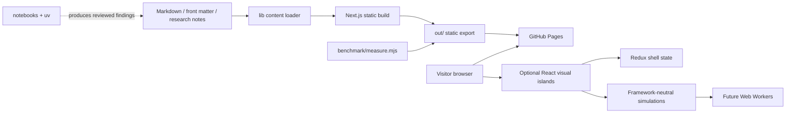
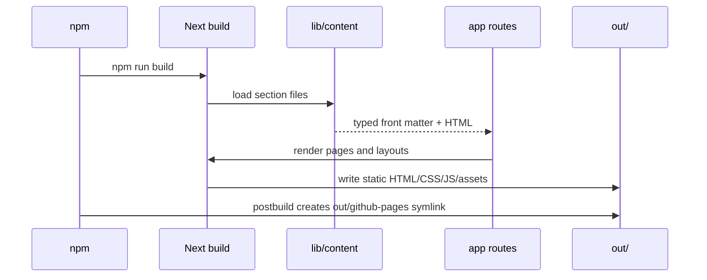
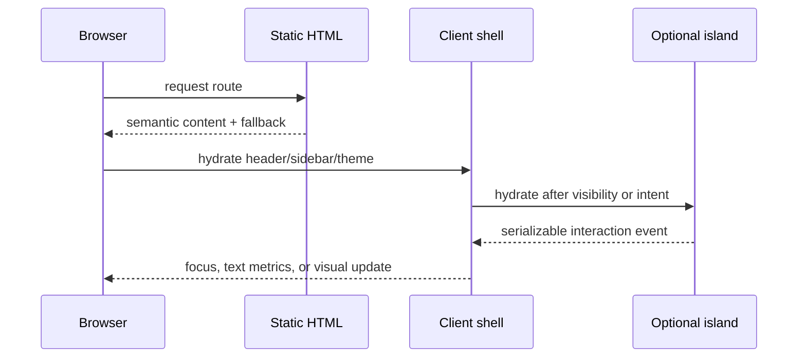
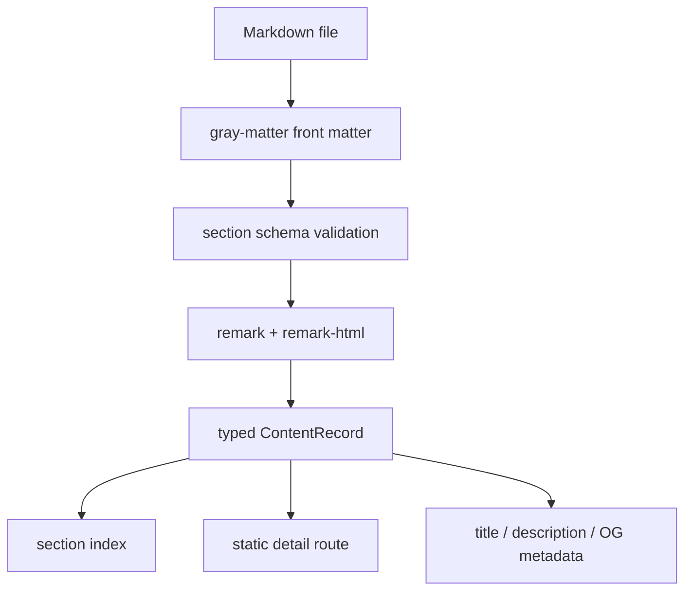
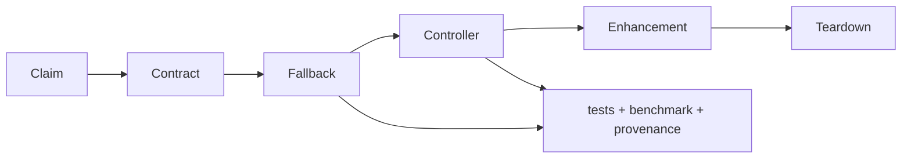
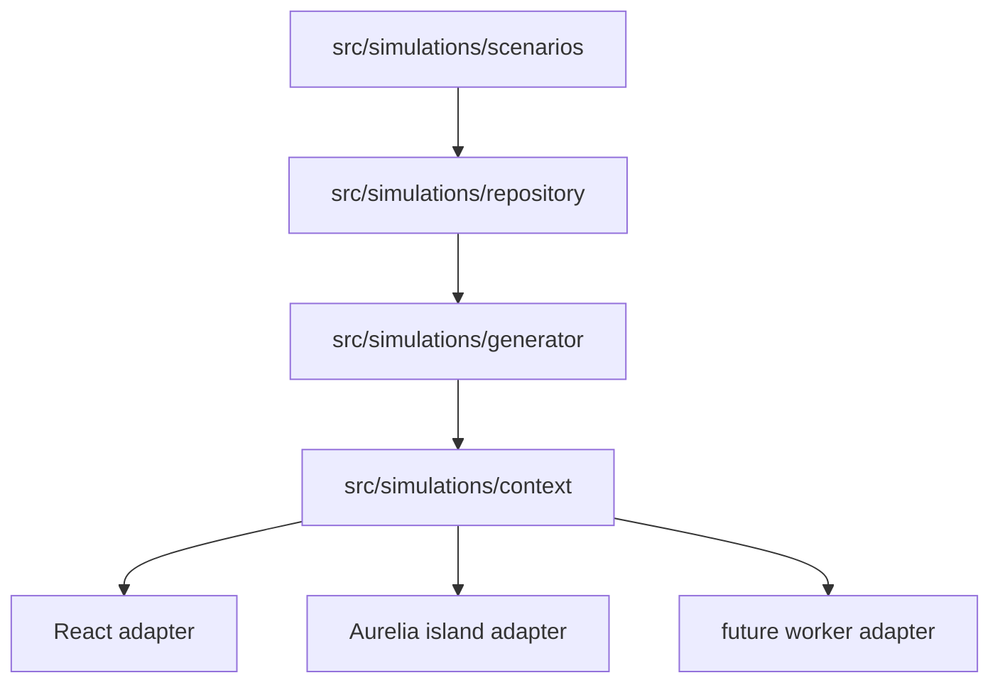
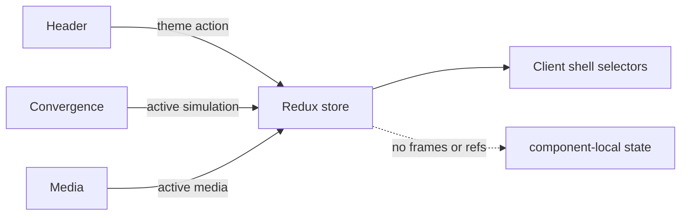
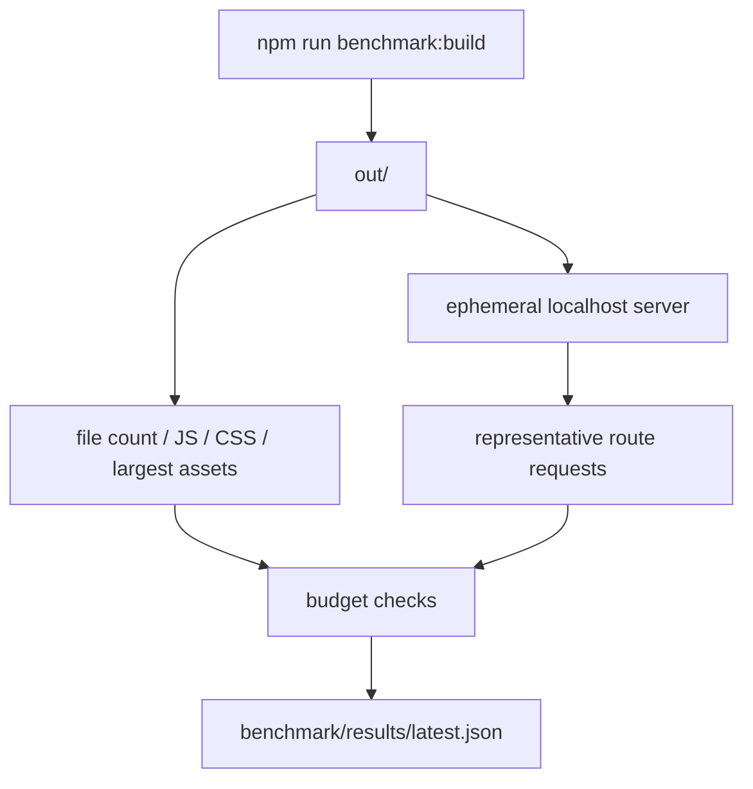

# Architecture

**Status:** Active · **Revision:** R3 · **Updated:** 2026-08-08

This document describes the executable architecture of `github-pages`, ACFHarbinger's static personal website and research observatory. It is intentionally implementation-oriented: a contributor should be able to locate a module, understand its ownership, run the relevant test, and choose the correct progressive-enhancement boundary without consulting tribal knowledge.

## Contents

- [Goals and non-goals](#goals-and-non-goals)
- [System context](#system-context)
- [Build and request flows](#build-and-request-flows)
- [Repository map](#repository-map)
- [Layer contracts](#layer-contracts)
- [Content pipeline](#content-pipeline)
- [Interactive experience architecture](#interactive-experience-architecture)
- [Simulation and Aurelia boundaries](#simulation-and-aurelia-boundaries)
- [Redux state architecture](#redux-state-architecture)
- [Rendering tiers and capability policy](#rendering-tiers-and-capability-policy)
- [Performance and benchmark architecture](#performance-and-benchmark-architecture)
- [Accessibility and resilience](#accessibility-and-resilience)
- [Security, privacy, and licensing](#security-privacy-and-licensing)
- [Testing architecture](#testing-architecture)
- [TypeScript and React excerpts](#typescript-and-react-excerpts)
- [Decision records](#decision-records)
- [Change checklist](#change-checklist)

## Goals and non-goals

### Goals

1. Preserve useful content when JavaScript, WebGL, WebGPU, audio, or a third-party asset fails.
2. Make research claims inspectable through citations, units, assumptions, provenance, and data equivalents.
3. Keep route code, domain components, simulation engines, and cross-route state independently testable.
4. Ship a small static export first, then hydrate optional visual islands after intent or visibility.
5. Keep experiments relevant to waste-fleet optimization, machine learning, game development, media, and technical/political history.

### Non-goals

- A runtime API, database, authentication system, or hidden analytics collector.
- Treating an illustrative simulation as a production solver or scientific publication.
- Making WebGPU, WebXR, 3D, audio, or continuous animation a prerequisite for reading.
- Putting every interactive feature into a single generic component directory.

## System context



The dashed research edge is deliberately one-way. Notebooks can produce a report, but the production site never imports Python, secrets, a database, or a notebook runtime.

## Build and request flows

### Static build



### Browser navigation



The fallback is the product. Hydration improves direct manipulation; it must not be the only way to discover a report or project.

## Repository map

```text
app/
  layout.tsx                 # document metadata and static shell boundary
  page.tsx                   # observatory landing page
  content/<section>/         # route pages and content indexes
src/
  aurelia/                   # optional Aurelia islands; never required globally
  components/
    audio/ books/ canvas/ games/ graph/ image/
    maps/ models/ routes/ video/  # focused domain components
    layout/ ui/                      # shell and shared presentation primitives
  configs/ constants/ enums/ hooks/ interfaces/
  context/ redux/ routes/ types/ utils/
  simulations/
    repository/              # contracts, serializable types, dataset lookup
    scenarios/               # immutable presets and fixtures
    generator/               # deterministic computations
    context/                 # lifecycle controllers
lib/                         # build-time Markdown/front-matter utilities
docs/
  ARCHITECTURE.md            # this document
  moon/ROADMAP.md            # product roadmap and evidence gates
  moon/roadmaps/             # issue-ready workstream roadmaps
  moon/research/             # research reports and source registers
benchmark/                   # production export performance harness
notebooks/                   # independent Python/uv research workspace
public/                      # licensed/static browser assets
test/
  unit/ integration/ cypress/ # fast tests, network tests, browser tests
```

## Layer contracts

| Layer | Owns | May import | Must not own |
| --- | --- | --- | --- |
| `app/` | routes, metadata, composition | `src`, `lib` | algorithms, browser-only globals at build time |
| `lib/` | front matter and Markdown parsing | Node parsing libraries | React state, network calls |
| `components/ui` | visual primitives and semantics | React, shared interfaces | route-specific business decisions |
| `components/<domain>` | one focused interactive or media surface | UI primitives, typed interfaces | global Redux for hover/cursor state |
| `simulations/generator` | deterministic calculations | repository contracts | DOM, React, wall clock, random global |
| `simulations/context` | lifecycle and orchestration | generator, repository | JSX and CSS |
| `redux` | cross-route experience preferences | serializable actions/reducers | simulation frames, media buffers, refs |
| `notebooks` | exploratory analysis | Python/uv dependencies | production imports |
| `benchmark` | build artifact measurements | Node standard library | user data, telemetry, secrets |

## Content pipeline

Content is authored in section-specific directories under `app/content`. A content file has front matter, Markdown body, and optional local assets. The loader validates the section and slug, parses Markdown at build time, and returns a typed record. Invalid front matter fails the build rather than producing a silently incomplete page.



Content links to research evidence but does not embed unreviewed notebook output. Reports distinguish measured results, illustrative fixtures, and hypotheses.

## Interactive experience architecture

Every interactive item follows the same decomposition:

1. **Claim:** a visible heading and one-sentence visitor question.
2. **Data contract:** a small immutable TypeScript type with units and provenance.
3. **Fallback:** list, table, SVG, still image, or ordinary links.
4. **Controller:** local state or a simulation controller, never a hidden singleton.
5. **Enhancement:** canvas, Three.js, Web Audio, map, or future WebGPU.
6. **Teardown:** event listeners, animation frames, contexts, workers, and object URLs released.
7. **Evidence:** test fixture, benchmark result, and roadmap ID.



Domain placement is intentional: a route animation belongs in `components/routes`, a spectrum in `audio`, a model in `models`, a reading shelf in `books`, and so on. Shared behavior belongs in hooks or utilities only when two domains have the same contract.

## Simulation and Aurelia boundaries

The simulation subsystem is framework-neutral. `repository/types.ts` contains serializable contracts; `scenarios/scenarios.ts` contains seeded fixtures; `generator` produces deterministic points; `context` exposes play/pause/step/reset and lifecycle status. React renders the controller through a client component. Aurelia mounts only inside an explicitly isolated island.



React and Aurelia must return the same snapshot for the same scenario and seed. A worker message is versioned, carries a request ID, and cannot overwrite a newer request.

## Redux state architecture

Redux is deliberately small. It currently stores theme, quality preference, active simulation, and active media because those can cross routes or independent surfaces. Hover, drag position, playback cursor, animation frame, form draft, and DOM refs remain local.



Persistence is browser-guarded. Static rendering sees the default state; hydration may restore a preference without changing the meaning of the content.

## Rendering tiers and capability policy

| Tier | Trigger | Rendering | Required equivalent |
| --- | --- | --- | --- |
| Static | no JS/WebGL, crawler, failure | HTML, SVG, table, still | full claim and controls as links |
| Reduced | reduced motion, low memory, coarse pointer | event-driven canvas, lower DPR, no post-processing | text metrics and keyboard path |
| Full | capable device and opt-in preference | Three.js/audio/map/WebGPU enhancement | same data and reset controls |

Capability detection is advisory. A device can report support and still fail allocation; every initializer catches failure and returns the fallback. Experimental WebGPU, WebXR, and splats are excluded from the default route payload until the benchmark and device matrix justify promotion.

## Performance and benchmark architecture

`benchmark/measure.mjs` measures the built artifact and representative HTTP responses. It does not use a browser and therefore cannot replace Lighthouse. Its output is a deterministic budget signal for pull requests.



Default budgets are 200 kB JavaScript, 80 kB CSS, 2 MB homepage transfer, 3 MB per route response, and 1 MB largest asset. If a roadmap item intentionally exceeds a budget, its document must record the user-facing value, static fallback, and mitigation.

## Accessibility and resilience

- Headings, landmarks, links, tables, and form labels exist before enhancement.
- Every visual encoding has a textual summary; color is never the only category.
- Focus is visible; keyboard controls mirror pointer controls; live regions avoid noisy frame-by-frame announcements.
- Reduced motion disables continuous animation and audio-reactive effects.
- Audio never autoplays; local media remains local; object URLs and audio contexts are released.
- 3D/model surfaces expose reset, pause, loading, error, and static poster states.
- Context loss, unsupported APIs, malformed data, timeout, cancellation, and worker crashes preserve a visitor-readable result.

## Security, privacy, and licensing

The static export has no server secrets. Do not add API keys to client code, fetch private research data at runtime, or upload local audio/images. Every external or generated asset needs a license/source entry beside the feature. Research data should be minimized, anonymized, and accompanied by a limitation statement.

## Testing architecture

| Test | Scope | Typical command |
| --- | --- | --- |
| Unit | pure utilities, reducers, generators | `npm run test:unit` |
| Integration | shell composition and mocked network | `npm run test:integration` |
| Browser smoke | route rendering and theme path | `npm run cypress:smoke` |
| E2E | user journeys against served export | `npm run cypress:e2e` |
| Static benchmark | export size and response budgets | `npm run benchmark:build && npm run benchmark` |

New interactive components require a deterministic fixture, fallback assertion, keyboard interaction test, and teardown test. Graphics snapshots should test data/selection semantics rather than brittle pixels unless a rendering regression is the explicit goal.

## TypeScript and React excerpts

### Serializable simulation contract

```ts
export interface SimulationScenario {
  id: string;
  seed: number;
  iterations: number;
  initialCost: number;
  convergenceRate: number;
}

export interface SimulationSnapshot {
  scenarioId: string;
  step: number;
  points: ReadonlyArray<{ step: number; cost: number }>;
  status: 'idle' | 'running' | 'paused' | 'complete' | 'error';
}
```

The contract contains no `Date`, `Error`, class instance, DOM node, function, or framework-specific object so it can cross React, Aurelia, tests, URL serialization, and a future worker.

### Capability-aware React island

```tsx
'use client';

export function ProgressiveSurface({ fallback }: { fallback: React.ReactNode }) {
  const [tier, setTier] = useState<'static' | 'reduced' | 'full'>('static');
  useEffect(() => {
    const reduced = window.matchMedia('(prefers-reduced-motion: reduce)').matches;
    setTier(reduced || !('requestAnimationFrame' in window) ? 'reduced' : 'full');
  }, []);
  if (tier === 'static') return <>{fallback}</>;
  return <div data-render-tier={tier}>{tier === 'full' ? <EnhancedView /> : <ReducedView />}</div>;
}
```

The real implementation should also observe visibility, capability failures, context loss, and teardown. The excerpt demonstrates the policy boundary: the fallback is an explicit input, not an afterthought.

### Redux action boundary

```ts
export type ExperienceAction =
  | { type: 'experience/themeChanged'; theme: 'light' | 'dark' }
  | { type: 'experience/qualityChanged'; quality: 'static' | 'reduced' | 'full' }
  | { type: 'experience/simulationActivated'; id: string | null };
```

Actions remain serializable and domain-neutral. A route cursor is not promoted to Redux merely because it is convenient.

### Worker protocol shape

```ts
export type WorkerMessage<T> =
  | { version: 1; requestId: string; kind: 'start'; payload: T }
  | { version: 1; requestId: string; kind: 'cancel' }
  | { version: 1; requestId: string; kind: 'progress'; fraction: number }
  | { version: 1; requestId: string; kind: 'result'; payload: unknown }
  | { version: 1; requestId: string; kind: 'error'; message: string };
```

Unknown versions fail safely. The controller checks the request ID before applying a result, which prevents stale work from replacing a newer scenario.

## Decision records

Architecture decisions live in [`docs/adr/`](adr/). Create an ADR before changing rendering ownership, adding a runtime backend, introducing a persistent canvas, changing the content schema, adding a model/audio format, or moving cross-route state into Redux.

Current architectural decisions:

1. Next.js static export is the deployment contract.
2. Markdown is parsed at build time.
3. Simulation algorithms are framework-neutral.
4. Domain components are separated by interaction/media type.
5. Progressive enhancement preserves a static equivalent.
6. Benchmarks are artifact-first, with browser profiling as a separate tier.

## Change checklist

Before opening a pull request:

- [ ] Identify the roadmap ID and visitor question.
- [ ] Choose the owning directory and explain why it is not a shared catch-all.
- [ ] Define serializable input/output contracts and units.
- [ ] Add semantic fallback, keyboard path, reduced-motion path, and error state.
- [ ] Release listeners, frames, contexts, workers, object URLs, and subscriptions.
- [ ] Add unit/integration/browser coverage appropriate to the risk.
- [ ] Run lint, typecheck, tests, build, and benchmark.
- [ ] Update changelog, roadmap status, architecture notes, and GitHub issue.
- [ ] Record measured bundle/performance changes and any new license.

## Document history

| Date | Revision | Change |
| --- | --- | --- |
| 2026-08-08 | R3 | Replaced the short overview with system flows, contracts, diagrams, excerpts, benchmark architecture, and contributor gates. |
