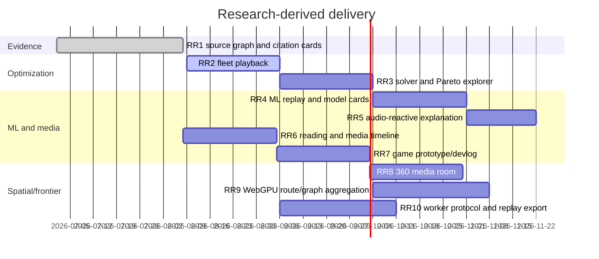

# Research-derived interaction roadmap

**Status:** Active (R2)  
**Owner:** Portfolio platform  
**Source:** [Interactive Features and Visual Storytelling Research](../research/Interactive%20Features%20and%20Visual%20Storytelling%20Research.md)  
**Last updated:** 2026-08-08

## Contents

- [Operating model](#operating-model)
- [Delivery timeline](#delivery-timeline)
- [Work packages](#work-packages)
- [Acceptance and measurement](#acceptance-and-measurement)
- [Risk and decision register](#risk-and-decision-register)
- [Effort × impact](#effort--impact)

## Operating model

Each experience starts with a semantic HTML claim, adds direct manipulation, and only then opts into canvas, 3D, audio, or WebGPU. Every enhanced view has a reduced-motion mode, keyboard path, text/data equivalent, deep-linkable state where useful, and a static recorded example. Research citations and measured results are kept separate from illustrative demos.

## Delivery timeline

## Work packages

### RR1 — Evidence graph and citation cards — Done

Create an accessible argument/source graph for papers, books, and political history. Use semantic links and a canvas enhancement; show source quality, date, license, and a short claim summary. **Acceptance:** keyboard traversal, linked list fallback, focus-visible nodes, and a citation snapshot test.

### RR2 — Waste-fleet route playback — In progress

Add seeded truck routes with play/pause, speed, scrubber, depot/vehicle filters, constraint toggles, and a table equivalent. Use a static SVG/canvas path first; deck.gl/Mapbox remains optional. **Acceptance:** deterministic frame snapshots, reduced-motion instant state, URL-shareable scenario/step, and no main-thread solver work.

### RR3 — Solver comparison and Pareto explorer — Planned

Compare baseline, heuristic, and best-known solutions with distance, vehicles, capacity utilization, feasibility, incumbent/bound, and gap. Plot a Pareto frontier and explain why a result is not necessarily optimal. **Acceptance:** infeasible and timeout fixtures, honest labels, downloadable JSON/CSV, and a result provenance panel.

### RR4 — ML training replay and model card — Planned

Replay a small deterministic policy-learning run, expose reward/cost curves, route decisions, latent projection, and a model card containing dataset, preprocessing, runtime, limitations, and version. Human-in-the-loop corrections become labelled events. **Acceptance:** CPU/static fixture fallback, reproducible seed, cancellation, unsupported-runtime message, and accessible data table.

### RR5 — Audio-reactive explanation — Planned

Map an audio spectrum to a route or graph visualization without claiming the sound is data. Use an `AnalyserNode` enhancement with a non-audio mode and explicit play/pause consent. **Acceptance:** mute/reduced-motion defaults, no autoplay, keyboard controls, and graceful unsupported-audio behavior.

### RR6 — Reading and media timeline — Planned

Unify anime, film/TV, technical reading, and political-history notes into filterable timeline, poster/shot mosaic, comparison slider, and bibliographic trail components. **Acceptance:** alt text/captions, source/license fields, deep links to filtered views, and a list fallback.

### RR7 — Game prototype and devlog — Planned

Ship a tiny playable mechanic plus a design-decision timeline and mechanics dependency graph. Keep the prototype isolated from the main bundle and provide a non-game case-study path. **Acceptance:** bounded input, pause/reset, keyboard controls, 30 FPS low-power mode, and an explanation of what was learned.

### RR8 — 360-degree media room — Planned

Present licensed 360 imagery or a cubemap with drag/pointer-lock-free camera controls, hotspot annotations, and a flat panorama fallback. **Acceptance:** no motion trap, reset heading, keyboard hotspot list, reduced-motion still, and lazy-loaded assets.

### RR9 — WebGPU route/graph aggregation — Research

Prototype GPU aggregation for thousands of route points or graph edges behind capability detection. WebGL/canvas/SVG and a recorded image remain the default fallback. **Acceptance:** adapter failure path, secure-context note, memory/transfer budget, and a representative benchmark.

### RR10 — Worker protocol and replay export — Planned

Standardize versioned worker messages, request IDs, progress, cancellation, stale-response rejection, transferable typed arrays, and replay export/import. **Acceptance:** malformed-message, timeout, crash, cancellation, unmount, and deterministic round-trip tests.

## Acceptance and measurement

For every package record LCP/INP/CLS, time-to-first-interaction, route chunk size, asset bytes, median and 1% frame time, heap after ten navigations, task completion/error rate, and accessibility findings. A package cannot move to Done until the static fallback and documented evidence are shipped.

## Risk and decision register

| ID | Risk/decision | Mitigation | Gate |
|---|---|---|---|
| RDI-1 | WebGPU/WebXR support is uneven | capability detection and recorded fallback | RR9 |
| RDI-2 | Visualization implies scientific certainty | provenance, model cards, best-known labels | RR3/RR4 |
| RDI-3 | Media licensing or privacy | self-host only licensed assets; redact data | RR6/RR8 |
| RDI-4 | Motion/audio excludes visitors | reduced modes, consent, equivalent tables | all |
| RDI-5 | Large data harms static performance | workers, typed arrays, lazy routes, budgets | RR2/RR10 |

## Effort × impact

| Package | Effort | Impact | Priority |
|---|---:|---:|---:|
| RR1/RR2 | M | High | P0 |
| RR3/RR4/RR6 | L | High | P1 |
| RR5/RR7/RR10 | M | Medium-high | P1 |
| RR8/RR9 | L/XL | Medium | P2 |

## Document history

| Date | Revision | Change |
|---|---|---|
| 2026-08-08 | R2 | Added research-derived packages, gates, evidence and measurements. |
