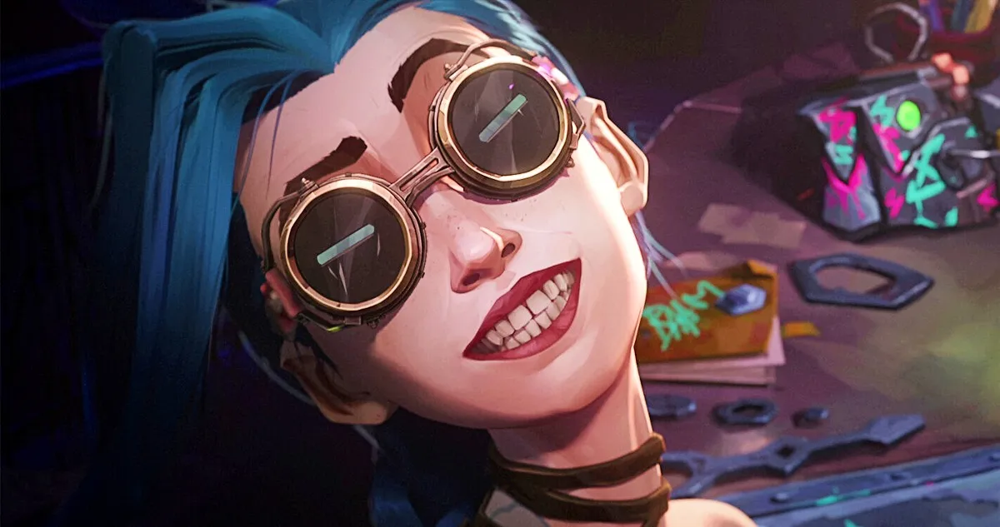

## Computer Science and Engineering (CSE)
### Artificial Intelligence Research
#### CSE Master of Science (MSc) Dissertation
Towards the completion of my CSE MSc degree at [IST](https://tecnico.ulisboa.pt/en/), I worked as a Graduate Student Researcher at [GAIPS](https://gaips.inesc-id.pt/), where I wrote a Dissertation titled ['Leveraging Deep Unsupervised Models Towards Learning Robust Multimodal Representations'](docs/IST_UL___MEIC_Thesis___Dissertacao_final__Copy_.pdf). For this Dissertation, I developed three new Multimodal Deep Unsupervised Models - which combined principles from [Denoising Auto-Encoders](docs/related_papers/2003.05991.pdf), [Geometric Multimodal Contrastive Learning](docs/related_papers/2202.03390.pdf) and [Odd-One-Out Networks](docs/related_papers/1611.06646.pdf) - and compared their robustness against missing modalities, noisy data and adversarial examples with other deep multimodal models such as the [MVAE](docs/related_papers/1802.05335.pdf). The final document and the respective code are (I also wrote a paper, but I still want to improve it before posting it to ARXIV):
- [Dissertation](docs/IST_UL___MEIC_Thesis___Dissertacao_final__Copy_.pdf)
- [Github Repository](https://github.com/ACFPeacekeeper/rgmc)